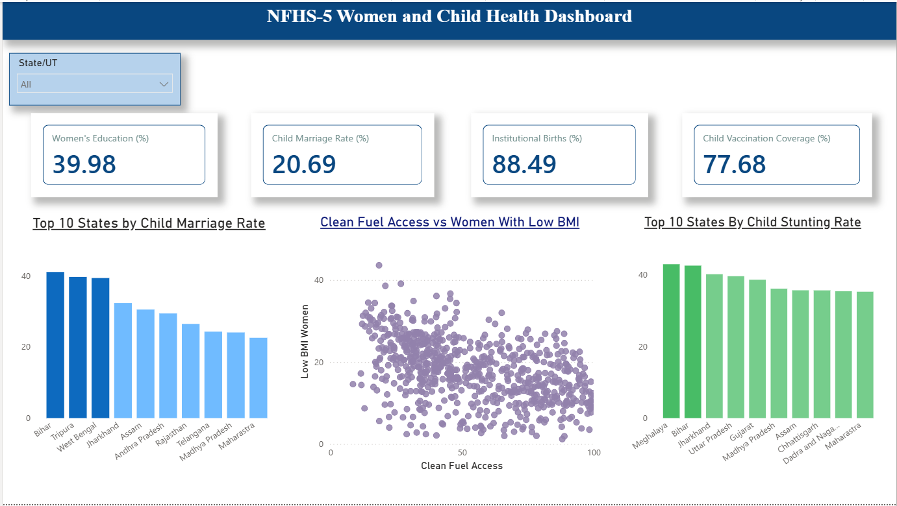
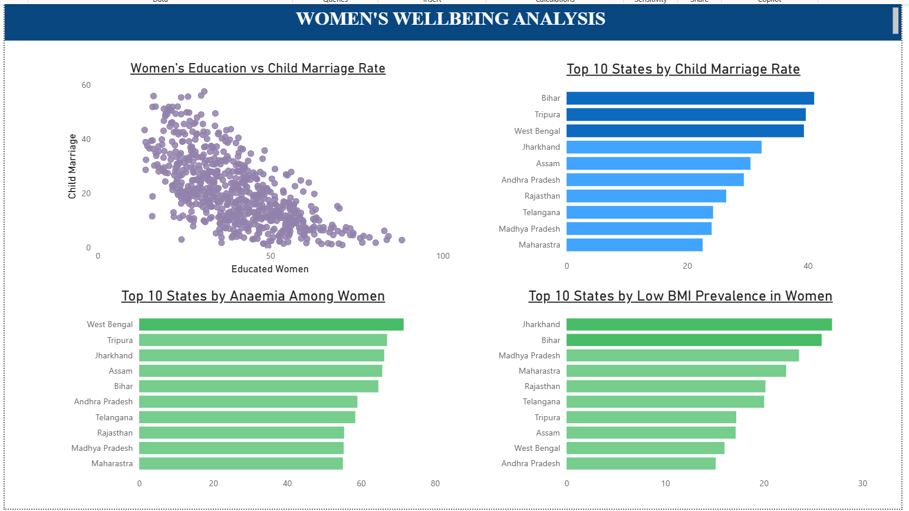
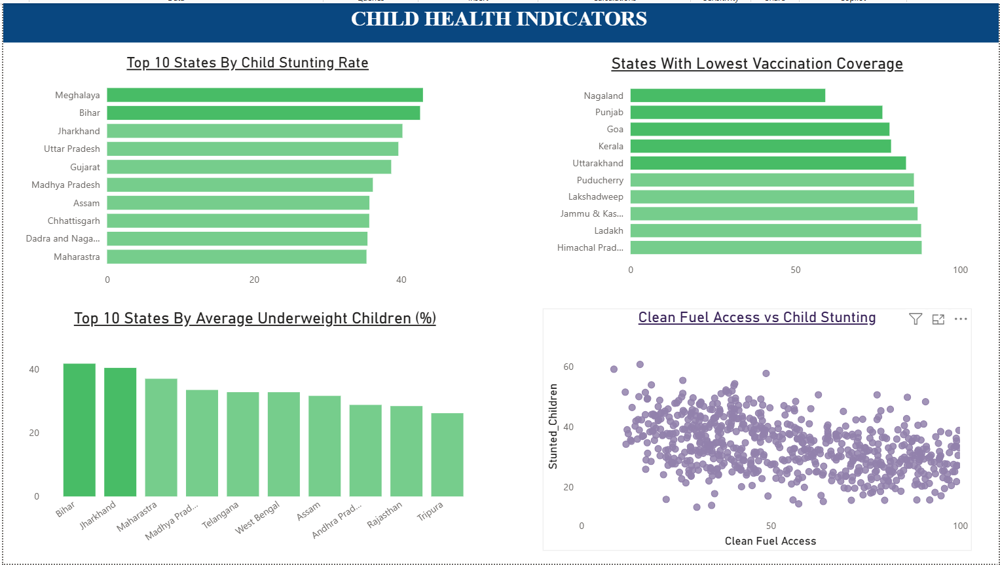
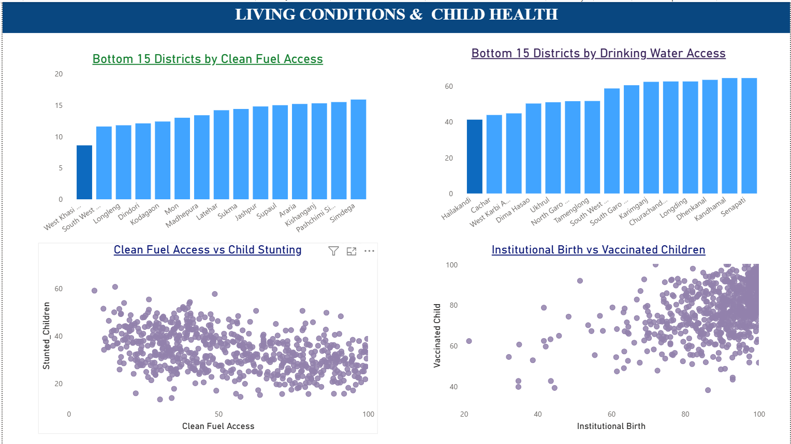

# NFHS-5 Women and Child Health Analytics Dashboard

## Overview

This project analyzes district-level data from India's National Family Health Survey (NFHS-5) to study women's wellbeing, child health outcomes, healthcare access, and living conditions across different states and districts.

The project combines Python-based data cleaning and exploratory data analysis (EDA) with an interactive Power BI dashboard to uncover patterns and relationships among key health indicators.

---

## Objectives

- Analyze women's wellbeing indicators such as education, child marriage, anaemia, and low BMI prevalence.
- Examine child health outcomes including stunting, underweight prevalence, and vaccination coverage.
- Explore the impact of living conditions such as clean fuel access and drinking water access on health outcomes.
- Identify states and districts that require greater policy attention based on health indicators.

---

## Dataset

**Source:** National Family Health Survey (NFHS-5)

The dataset contains district-level indicators related to:

- Women's Education (%)
- Child Marriage Rate (%)
- Institutional Births (%)
- Child Vaccination Coverage (%)
- Child Stunting (%)
- Underweight Children (%)
- Anaemia Among Women (%)
- Low BMI Among Women (%)
- Clean Fuel Access (%)
- Drinking Water Access (%)

---

## Tools & Technologies

- Python
- Pandas
- NumPy
- Matplotlib
- Jupyter Notebook
- Power BI
- Git
- GitHub

---

## Data Cleaning & Preparation

The following preprocessing steps were performed:

- Selected relevant health and socioeconomic indicators
- Renamed lengthy column names for readability
- Removed special characters and formatting inconsistencies
- Handled missing values
- Converted columns to appropriate numeric data types
- Performed exploratory data analysis (EDA)

---

## Dashboard Pages

### 1. Overview Dashboard

Provides a high-level summary of major health indicators.

Features:

- Women's Education KPI
- Child Marriage Rate KPI
- Institutional Births KPI
- Child Vaccination Coverage KPI
- Top 10 States by Child Marriage Rate
- Top 10 States by Child Stunting Rate
- Clean Fuel Access vs Women with Low BMI

---

### 2. Women's Wellbeing Analysis

Focuses on educational and maternal health indicators.

Features:

- Women's Education vs Child Marriage Rate
- Top 10 States by Child Marriage Rate
- Top 10 States by Anaemia Among Women
- Top 10 States by Low BMI Prevalence in Women

---

### 3. Child Health Indicators

Focuses on nutrition and healthcare outcomes among children.

Features:

- Top 10 States by Child Stunting Rate
- Top 10 States with Lowest Vaccination Coverage
- Top 10 States by Average Underweight Children (%)
- Clean Fuel Access vs Child Stunting

---

### 4. Living Conditions & Child Health

Examines relationships between infrastructure access and child health outcomes.

Features:

- Bottom 15 Districts by Clean Fuel Access
- Bottom 15 Districts by Drinking Water Access
- Clean Fuel Access vs Child Stunting
- Institutional Births vs Vaccinated Children

---

## Key Insights

### Women's Wellbeing

- Women's education and child marriage rates show a strong inverse relationship.
- States with higher child marriage rates generally exhibit poorer women's wellbeing indicators.
- Low BMI prevalence remains high in several states, highlighting nutritional challenges among women.

### Child Health

- Meghalaya, Bihar, and Jharkhand rank among the states with the highest child stunting rates.
- Vaccination coverage varies significantly across states, indicating regional disparities in healthcare access.
- States with higher underweight child prevalence often overlap with states experiencing higher child stunting rates.

### Living Conditions & Health

- Districts with lower clean fuel access generally show higher levels of child stunting.
- Clean fuel access appears negatively associated with child stunting.
- Institutional births show a positive association with child vaccination coverage.
- Several districts continue to face challenges related to drinking water and clean fuel access.

### Overall Observation

Women's wellbeing, healthcare access, and living conditions appear closely linked to child health outcomes across districts and states in India.

---

## Dashboard Screenshots

### Overview Dashboard



### Women's Wellbeing Analysis



### Child Health Indicators



### Living Conditions & Child Health



---

## Repository Structure

```text
india_health_analytics_nhfs/
│
├── data/
│   └── data.csv
│
├── notebooks/
│   └── eda.ipynb
│
├── dashboard/
│   └── nfhs_dashboard.pbix
│
├── screenshots/
│   ├── overview.png
│   ├── women_wellbeing.png
│   ├── child_health.png
│   └── living_conditions.png
│
├── requirements.txt
│
└── README.md
```

---

## Future Improvements

- Add district-level geospatial visualizations
- Develop predictive machine learning models using NFHS indicators
- Deploy the dashboard as a web application
- Incorporate additional health and demographic variables

---
